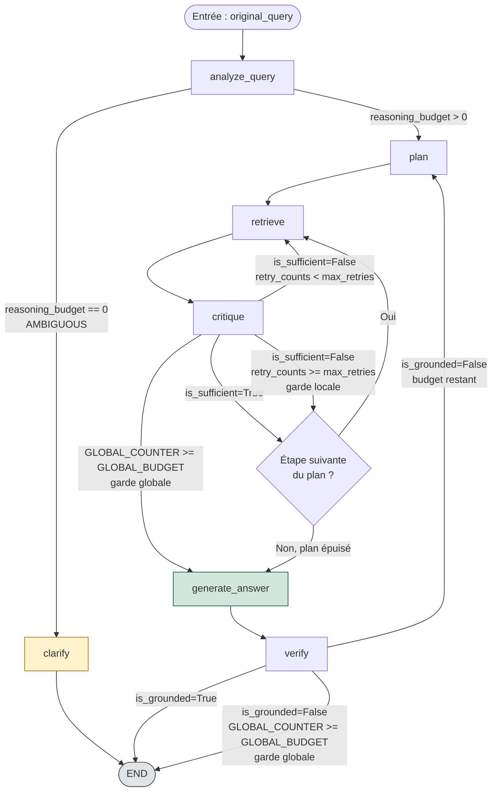

# Graphe d'Orchestration REASONING — Sprint 6

Diagramme du graphe LangGraph assemblé dans `src/reasoning/graph/graph.py`.
Voir `docs/graph_spec.md` pour la spécification complète (nœuds, arêtes
conditionnelles, budget global unique, `ReasoningPolicy`).

## Légende des gardes anti-boucle

- **Garde globale** (`GLOBAL_COUNTER = AgentState.feedback_loop_count`,
  `GLOBAL_BUDGET = AgentState.analysis.reasoning_budget`) : incrémentée à
  chaque passage par `critique` ou `verify`. Prioritaire sur toute autre
  décision de routage.
- **Garde locale** (`retry_counts[step_id]` vs `Critic.max_retries`) :
  bornée par étape (`PlanStep`), imbriquée dans la garde globale.

La combinaison des deux gardes garantit un nombre fini de nœuds visités par
requête, indépendamment du comportement du LLM (cf. `docs/graph_spec.md §3.4`
pour la preuve de terminaison).
